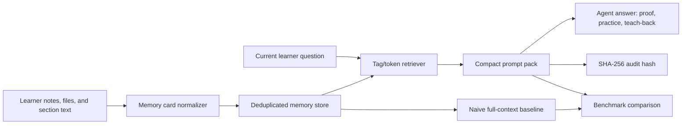

# Architecture

The prototype keeps the agent CPU-friendly by replacing full-history prompting with deterministic memory retrieval. It can be validated on x86 and Arm64 because it uses only the Python standard library.
